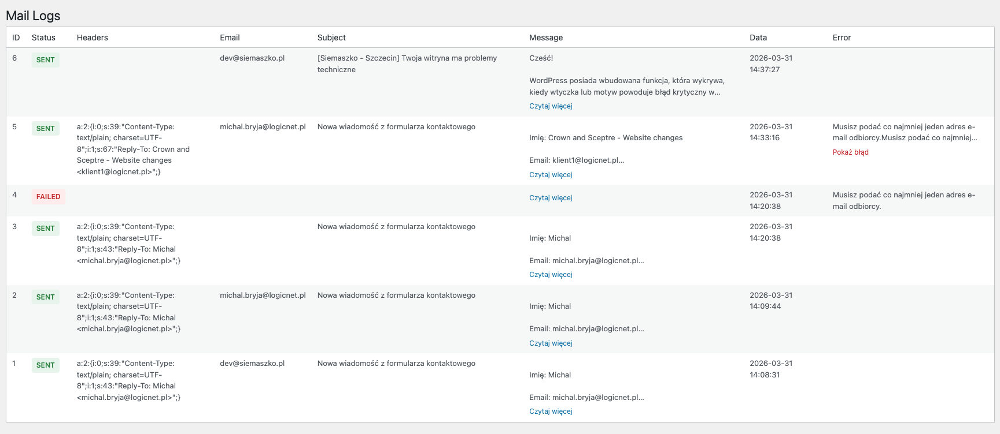

# WP Mail Inspector

WP Mail Inspector is a lightweight WordPress plugin that logs all outgoing emails sent via `wp_mail()`.

## Features

- Logs all emails sent via WordPress
- Tracks status: sent / failed
- Stores logs in a dedicated database table
- Admin panel with table view
- Expandable message and error fields
- Clean and performant architecture

## Preview

## How It Works

The plugin hooks into:
- `wp_mail` – captures outgoing emails
- `wp_mail_failed` – logs failed emails

It does NOT guarantee email delivery, only that WordPress attempted to send the email.

## Installation

1. Upload the plugin folder to `/wp-content/plugins/`
2. Activate the plugin in WordPress admin
3. Navigate to **Mail Inspector** in admin menu

## Database

Creates a custom table:
`wp_wmi_logs`

Stores:
- status
- recipient
- subject
- message
- headers
- error (if any)
- timestamp

## Admin UI

- Table view of latest logs
- Status highlighting (green/red)
- Expandable message and error fields

## Limitations

- Only logs emails sent via `wp_mail()`
- Cannot confirm actual delivery to inbox

## Future Improvements

- Filters and search
- Pagination
- Detailed view modal
- Retry email feature

## License

MIT